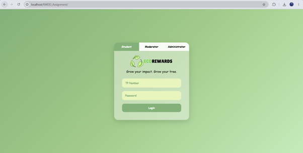
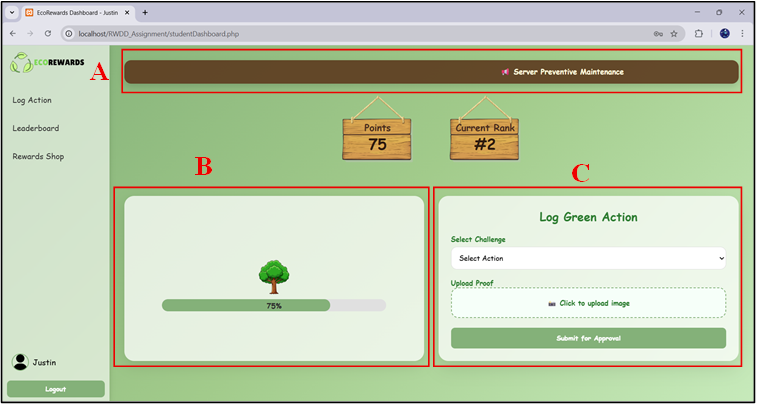
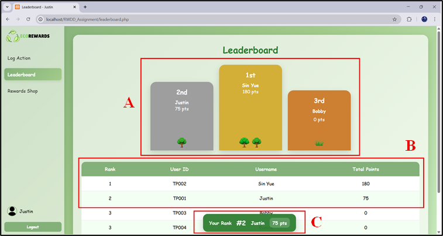

# EcoRewards System

## Overview

EcoRewards is a web-based sustainability platform designed to encourage environmentally friendly behavior through a reward-based system. Users can submit proof of eco-friendly activities, earn points after moderator verification, and redeem rewards through the platform.

## Features

- User registration and login
- Eco-friendly activity submission with photo evidence
- Moderator verification system
- Points accumulation and tracking
- Reward redemption system
- User profile management

## Technologies Used

- HTML
- CSS
- JavaScript
- PHP
- MySQL

## My Contributions
- Developed login page
- Developed points visualization features
- Implemented activity submission and verification workflow
- Designed reward redemption mechanism
- Participated in system testing and debugging

## Screenshots

### Login Page

### Dashboard

### Leaderboard

### Reward Redemption

## Future Improvements

- Mobile application support
- Real-time notification system
- Integration with environmental organizations
